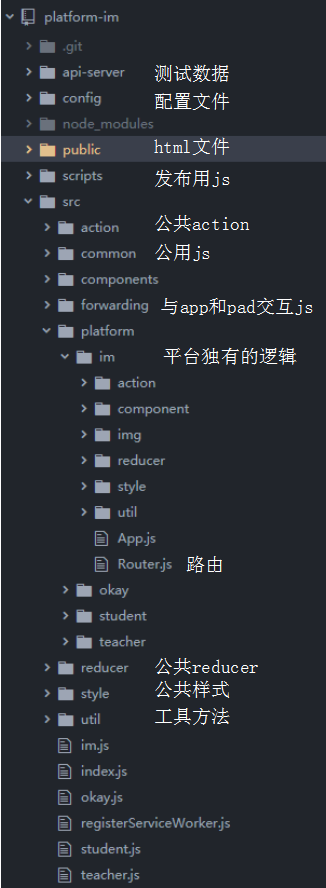
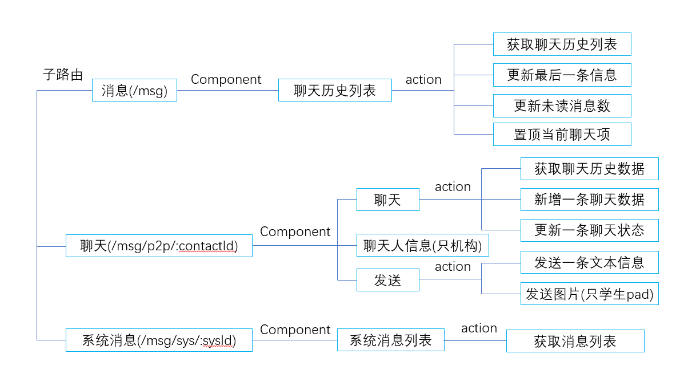
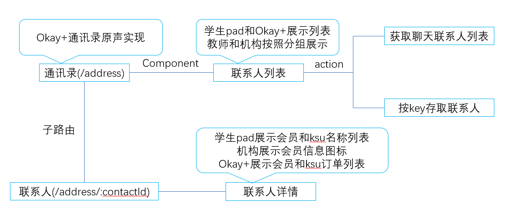

## 代码目录

## 路由

1. __消息__

2. __联系人__

## 已完成公共组件
1. 历史聊天列表
2. 聊天记录列表（有点bug，有图片的情况首屏定位有点问题，修改）
3. 图片预览
4. 发送消息（目前是三套，目标一套）
5. 系统消息列表
6. 通讯录列表
7. 用户信息详情（三套）
8. 空状态
9. loading
10. 懒加载列表
11. Dialog
12. badge
## 待优化
1. Toast组件
目前还在使用fe-common中的Tip组件，
流行toast组件库[react-toastify](https://github.com/fkhadra/react-toastify)，参照一下实现一个简版
2. axios跟dispatch关联起来
目前是加载后把dispatch强行注入到axios中，正确的做法应该是通过中间件，流行中间件库[redux-axios-middleware](https://github.com/svrcekmichal/redux-axios-middleware),但是使用这个库需要改变写action的方式，需要再研究下
3. 列表渲染的优化
流行库[react-vis](https://github.com/uber/react-vis)
4. 增强app体验
列表拖动到顶部和底部的效果
5. 样式主题
6. 性能优化
Route-based code splitting
